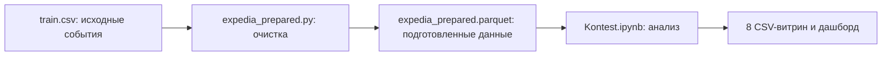

# Аналитика бронирований Expedia

Проект продуктовой аналитики на данных соревнования Expedia Hotel Recommendations. Исходный датасет содержит обезличенные события поиска, просмотра и бронирования отелей за 2013-2014 годы.

В отличие от исходной задачи Kaggle, здесь не обучается модель рекомендаций. Цель проекта - изучить поведение пользователей, оценить конверсию, найти сильные и слабые сегменты, выявить сезонность и определить точки роста продукта.

[Открыть интерактивный дашборд в Yandex DataLens](https://datalens.yandex/yu11u5cnogk6h)

## Задачи проекта

1. Подготовить большой исходный `train.csv` к анализу без загрузки всего файла в оперативную память.
2. Очистить данные и добавить продуктовые признаки.
3. Построить восемь аналитических витрин.
4. Исследовать сезонность, пользовательские сегменты, города, рынки и кластеры отелей.
5. Найти зоны с низкой конверсией и сформулировать продуктовые гипотезы для A/B-тестов.

## Пайплайн



`train.csv` и `expedia_prepared.parquet` не хранятся в репозитории из-за их размера. Готовые агрегированные витрины уже включены, поэтому основные результаты можно изучать без повторной обработки исходного файла.

## Масштаб данных

| Показатель | Значение |
|---|---:|
| Строк в подготовленном Parquet | 37 670 293 |
| Валидных строк после фильтрации | 37 399 136 |
| Взаимодействий с отелями | 55 513 204 |
| Бронирований | 3 040 533 |
| Уникальных пользователей | 1 198 161 |
| Пользователей хотя бы с одним бронированием | 812 572 |
| Общая конверсия | 5,48% |
| Кластеров отелей | 100 |
| Анонимизированных ID городов | 50 374 |
| Рынков отелей | 2 118 |

Взаимодействия и бронирования учитывают вес `cnt`. Поэтому `interactions = sum(cnt)`, а `bookings = sum(is_booking * cnt)`.

## Структура репозитория

| Файл | Назначение |
|---|---|
| `.gitignore` | Исключает из Git локальные, временные и слишком большие файлы. |
| `expedia_prepared.py` | Потоково читает `train.csv` через DuckDB, приводит типы, проверяет качество, создаёт признаки и сохраняет `expedia_prepared.parquet` с ZSTD-сжатием. |
| `Kontest.ipynb` | Содержит исследовательский анализ, построение витрин и графики по сезонности и сегментам. |
| `vitrina_main_segments.csv` | Основные срезы: сайт, континент точки продаж, страна пользователя, канал, mobile, package, family, urgent, long stay, день недели и время суток. |
| `vitrina_special_segments.csv` | Специальные продуктовые сегменты: тип группы, семьи, мобильные пользователи, пакеты, срочные и длительные поездки. |
| `vitrina_time_patterns.csv` | 28 комбинаций из семи дней недели и четырёх периодов суток. |
| `vitrina_unique_users.csv` | Одна строка на пользователя: взаимодействия, бронирования, индивидуальная конверсия и флаг бронирующего пользователя. |
| `vitrina_all_segments.csv` | Объединение основной и специальной витрин для общей работы с сегментами. |
| `vitrina_city_segments.csv` | Показатели по 50 374 анонимизированным ID городов пользователей. |
| `vitrina_hotel_segments.csv` | Показатели по 100 кластерам отелей. |
| `vitrina_market_segments.csv` | Показатели по 2 118 рынкам отелей. |

## Что делает скрипт подготовки

`expedia_prepared.py` обрабатывает исходный CSV через DuckDB, поэтому файл размером около 4 ГБ не загружается целиком в Pandas.

Скрипт:

- безопасно приводит 24 исходных поля к нужным типам через `TRY_CAST`;
- проверяет даты поиска, заезда и выезда;
- исключает отрицательный срок до поездки и некорректную длительность проживания;
- проверяет состав группы, количество комнат, флаг бронирования и вес `cnt`;
- сохраняет отдельные флаги ошибок и итоговый `is_valid_for_analysis`;
- создаёт новые продуктовые признаки;
- записывает результат в Parquet с ZSTD-сжатием;
- при необходимости сравнивает новый Parquet с эталонным по схеме, числу строк и значениям.

### Создаваемые признаки

| Признак | Значение |
|---|---|
| `search_date` | Дата поиска. |
| `search_month` | Месяц поиска. |
| `lead_time_days` | Количество дней от поиска до заезда. |
| `stay_nights` | Продолжительность проживания в ночах. |
| `party_size` | Общее количество взрослых и детей. |
| `is_family` | Есть хотя бы один ребёнок. |
| `is_urgent` | До заезда осталось от 0 до 7 дней. |
| `is_long_stay` | Продолжительность проживания не менее 7 ночей. |
| `lead_time_bucket` | Интервал планирования: день в день, 1-7, 8-30, 31-90 или 91+ дней. |
| `stay_bucket` | Интервал длительности: 1, 2-3, 4-6 или 7+ ночей. |
| `party_type` | `solo`, `couple`, `family`, `group` или `unknown`. |
| `event_weight` | Вес взаимодействия, равный `cnt`. |
| `booking_weight` | Вес бронирования, равный `is_booking * cnt`. |
| `is_valid_for_analysis` | Итоговый флаг пригодности строки для анализа. |

## Основные метрики витрин

| Метрика | Расчёт и смысл |
|---|---|
| `interactions` | `sum(cnt)`. Общее число взвешенных взаимодействий. |
| `bookings` | `sum(is_booking * cnt)`. Общее число взвешенных бронирований. |
| `booking_rate` | `bookings / interactions`. Основная событийная конверсия. |
| `unique_users` | Число уникальных `user_id` внутри сегмента. |
| `share_of_users` | Доля пользователей, относящихся к значению сегмента. |
| `share_of_interactions` | Доля взаимодействий, относящихся к значению сегмента. |
| `gap_from_mean` | Разница между конверсией значения и средней конверсией внутри этого типа сегмента. |
| `potential_bookings` | Расчётный резерв до средней конверсии: `interactions * (mean_booking_rate - booking_rate)`. |

`potential_bookings` используется только для приоритизации проблемных сегментов. Это диагностическая оценка, а не прогноз гарантированного роста.

## Ключевые результаты

- Общая событийная конверсия составляет 5,48%.
- Лучший временной интервал - пятница утром с конверсией 6,56%.
- Самый слабый временной интервал - суббота вечером с конверсией 4,47%.
- Срочные поездки конвертируются на уровне 9,18%, несрочные - 4,50%.
- Мобильный сегмент показывает 3,98% против 5,71% у немобильного.
- Пакетные предложения показывают 2,54% против 6,68% у непакетных.
- Длительные поездки показывают только 2,05% конверсии.
- Кластер 91 сочетает максимальный объём и высокую конверсию: 1,45 млн взаимодействий и 8,43%.
- Кластер 65 имеет 1,17 млн взаимодействий, но конверсию только 1,86%. Его расчётный резерв до средней кластерной конверсии составляет около 39,5 тыс. бронирований.

## Продуктовые точки роста

1. Запустить акцию `Weekend Specials`, чтобы приблизить конверсию субботы и воскресенья к уровню рабочих дней.
2. Проверить режим `Urgent Stabilizer` для срочных бронирований: заметная выгода, таймер предложения и упрощённый путь бронирования.
3. Улучшить ранжирование отелей для кластера 65 и поднять наиболее релевантные варианты в начало выдачи.

Каждое изменение должно проверяться отдельным A/B-тестом.

## Быстрый старт

### 1. Требования

- Python 3.10 или новее
- Jupyter Notebook
- не менее 10 ГБ свободного места для исходного CSV и Parquet

Установите зависимости:

```bash
python -m venv .venv
```

Windows PowerShell:

```powershell
.venv\Scripts\Activate.ps1
```

macOS или Linux:

```bash
source .venv/bin/activate
```

```bash
pip install duckdb pandas numpy pyarrow matplotlib seaborn plotly jupyter
```

### 2. Подготовка исходных данных

Скачайте `train.csv` со [страницы данных Kaggle](https://www.kaggle.com/competitions/expedia-hotel-recommendations/data) и поместите его в корень проекта.

Создайте подготовленный Parquet:

```bash
python expedia_prepared.py --input train.csv --output expedia_prepared.parquet
```

Если файл с таким именем уже существует и его нужно заменить:

```bash
python expedia_prepared.py --input train.csv --output expedia_prepared.parquet --force
```

### 3. Запуск анализа

```bash
jupyter notebook Kontest.ipynb
```

Перед выполнением основных ячеек замените локальные абсолютные пути в ноутбуке:

```python
file_path = "expedia_prepared.parquet"
output_dir = "."
```

В ноутбуке также встречаются пути вида `/Users/polina-tru/Desktop/...`. Их нужно заменить на пути на вашем компьютере.

Первые исследовательские ячейки читают `test.csv`, `destinations.csv` и `sample_submission.csv`. Для построения восьми витрин они не нужны. Основной пайплайн начинается с ячейки, в которой задаются `file_path`, `output_dir` и `columns_to_load`.

Если нужны только готовые результаты, этапы подготовки и запуска ноутбука можно пропустить. Все восемь CSV-витрин уже находятся в репозитории.

## Важные особенности интерпретации

1. Все географические значения и кластеры анонимизированы. Например, `user_location_city = 5703` является ID, а не названием города. В исходных данных нет словаря для восстановления реальных названий.
2. Данные относятся к 2013-2014 годам и не описывают текущее состояние Expedia.
3. `vitrina_main_segments.csv`, `vitrina_special_segments.csv` и `vitrina_all_segments.csv` имеют вертикальную структуру из нескольких независимых срезов. Перед расчётом итогов обязательно фильтруйте данные по `segment_name`. Нельзя суммировать все строки этих файлов как одну таблицу.
4. Пустые ячейки в широких сегментных витринах являются структурными. Например, строка сегмента `is_mobile` не должна содержать значение в колонке `is_package`.
5. Поле `unique_bookers` в агрегированных сегментных витринах не является числом уникальных бронирующих пользователей: флаг пользователя повторяется в строках взаимодействий и затем суммируется. Не используйте это поле для пользовательской конверсии.
6. Для событийной конверсии используйте `booking_rate`. Для корректного анализа на уровне пользователей используйте `vitrina_unique_users.csv`, где одна строка соответствует одному `user_id`.

## Технологии

- Python
- DuckDB
- Pandas
- NumPy
- PyArrow
- Plotly
- Matplotlib
- Seaborn
- Jupyter Notebook
- Yandex DataLens
